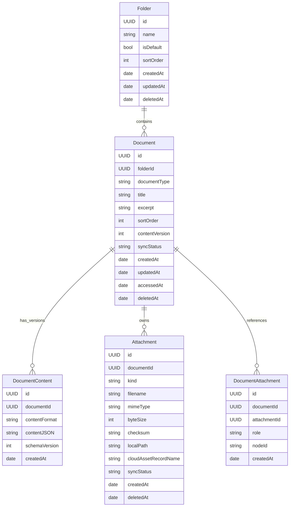

# 数据库设计

## 1. 设计目标

本产品是本地优先、CloudKit 同步的个人文档应用。数据库设计需要同时满足 iOS 本地 SwiftData 持久化、CloudKit 私有库同步、离线编辑、附件管理，以及未来多种文档类型扩展。

核心原则：

- 文件夹和文档是独立实体，默认文件夹也是一条真实数据。
- 文档正文只保存结构化内容，不直接内嵌图片、附件等二进制数据。
- Tiptap JSON 是 page 文档的唯一正文持久化格式。
- 图片、附件、未来画板素材等统一进入附件表，由正文或文档数据引用。
- 预留 `documentType`，不要把所有文档都假设为富文本 page。
- 本地写入优先，CloudKit 同步状态是附加状态，不阻塞编辑。

## 2. 核心实体



## 3. Folder

文件夹用于组织文档。默认文件夹不建议做成代码里的虚拟节点，而应该在首次启动或迁移时创建真实记录，便于排序、统计、迁移和 CloudKit 同步。

| 字段 | 类型 | 说明 |
| --- | --- | --- |
| `id` | UUID | 全局唯一 ID，本地和 CloudKit 共用 |
| `name` | String | 文件夹名称 |
| `isDefault` | Bool | 是否默认文件夹 |
| `sortOrder` | Int | 手动排序字段 |
| `createdAt` | Date | 创建时间 |
| `updatedAt` | Date | 更新时间 |
| `deletedAt` | Date? | 软删除时间，MVP 可先保留不用 |

约束：

- 每个用户数据域只能有一个 `isDefault = true` 的文件夹。
- 新文档没有指定文件夹时进入默认文件夹。
- 默认文件夹不能被真正删除；如果用户想清空，只删除或移动其中的文档。
- 用户新增文件夹时，`isDefault = false`。

默认文件夹建议名称：

- 中文：`默认文件夹`
- 如果后续做国际化，名称可以是展示层文案，数据层只保存稳定标识。

## 4. Document

文档是列表、搜索、文件夹归属、同步和生命周期的主实体。正文内容不要全部塞在 Document 里，避免未来版本、增量保存和不同文档类型被当前 page 结构绑死。

| 字段 | 类型 | 说明 |
| --- | --- | --- |
| `id` | UUID | 文档唯一 ID |
| `folderId` | UUID | 所属文件夹 ID |
| `documentType` | String | 文档类型，见下方枚举 |
| `title` | String | 标题，列表展示和搜索用 |
| `excerpt` | String | 可选摘要，列表展示用，可按需从 `DocumentContent.contentJSON` 派生 |
| `sortOrder` | Int | 文件夹内手动排序预留 |
| `contentVersion` | Int | 内容版本号，每次正文变更递增 |
| `syncStatus` | String | `localOnly`、`pendingUpload`、`synced`、`failed` |
| `createdAt` | Date | 创建时间 |
| `updatedAt` | Date | 更新时间 |
| `accessedAt` | Date | 最近访问时间，文档被打开时更新，首页按该字段倒序展示最近访问文档 |
| `deletedAt` | Date? | 软删除时间 |

`documentType` 建议值：

| 值 | 说明 |
| --- | --- |
| `page` | Tiptap 富文本页面，MVP 主类型 |
| `mindMap` | 思维导图 |
| `whiteboard` | 画板 |
| `flowchart` | 流程图 |

设计要点：

- 列表页只查 `Document`，不需要加载完整正文。
- `title` 由编辑器快照直接提供；`excerpt` 如需展示可从正文派生，但不保存 `plainText` 副本。
- 删除建议先软删除，CloudKit 同步确认后再考虑清理附件。
- `contentVersion` 用于保存防抖、冲突检测和后续版本历史。

## 5. DocumentContent

文档正文表保存不同类型文档的核心 JSON 数据。MVP 可以每个文档只保留一条当前内容；如果后续要做历史版本，可以让一篇文档对应多条内容快照。

| 字段 | 类型 | 说明 |
| --- | --- | --- |
| `id` | UUID | 内容记录 ID |
| `documentId` | UUID | 所属文档 ID |
| `contentFormat` | String | 内容格式，例如 `tiptap-json`、`mindmap-json` |
| `contentJSON` | String | JSON 字符串 |
| `schemaVersion` | Int | 内容 schema 版本 |
| `createdAt` | Date | 内容记录创建时间 |

各文档类型的 `contentFormat`：

| documentType | contentFormat | 说明 |
| --- | --- | --- |
| `page` | `tiptap-json` | Tiptap `editor.getJSON()` 结果 |
| `mindMap` | `mindmap-json` | 节点和边的结构化 JSON |
| `whiteboard` | `whiteboard-json` | 画布元素、坐标、样式、素材引用 |
| `flowchart` | `flowchart-json` | 流程节点、连线、布局信息 |

Tiptap page 内容约束：

- `contentJSON` 不保存 Markdown 副本。
- 图片节点、附件节点只保存附件引用，不保存 base64。
- 每个可引用附件的节点应有稳定 `attachmentId`。
- 如果需要导出 Markdown，在导出时从 JSON 临时转换，不回写数据库。

示例图片节点：

```json
{
  "type": "image",
  "attrs": {
    "attachmentId": "A5C9A548-2D62-4A1A-9F9A-B7B4E4B9A7C2",
    "src": "attachment://A5C9A548-2D62-4A1A-9F9A-B7B4E4B9A7C2",
    "alt": "会议白板照片",
    "width": 1200,
    "height": 800
  }
}
```

示例附件节点：

```json
{
  "type": "attachment",
  "attrs": {
    "attachmentId": "4966F7F6-9F95-47EF-97E5-4E2834BB1E7D",
    "filename": "需求草稿.pdf",
    "mimeType": "application/pdf",
    "byteSize": 381024
  }
}
```

## 6. Attachment

图片、文件、视频、未来画板素材都进入统一附件模型。数据库保存元数据和引用，文件本体保存在本地应用容器中，并通过 CloudKit CKAsset 同步。

| 字段 | 类型 | 说明 |
| --- | --- | --- |
| `id` | UUID | 附件唯一 ID，正文通过它引用 |
| `documentId` | UUID | 归属文档 ID |
| `kind` | String | `image`、`file`、`video`、`audio`、`canvasAsset` |
| `filename` | String | 展示文件名 |
| `mimeType` | String | MIME 类型 |
| `byteSize` | Int | 文件大小 |
| `checksum` | String? | 文件校验值，用于去重和完整性检查 |
| `localPath` | String | App 容器内相对路径 |
| `cloudAssetRecordName` | String? | CloudKit 附件记录名或资产记录标识 |
| `syncStatus` | String | `localOnly`、`pendingUpload`、`synced`、`failed` |
| `createdAt` | Date | 创建时间 |
| `deletedAt` | Date? | 软删除时间 |

附件存储建议：

- 本地路径使用相对路径，例如 `Attachments/{documentId}/{attachmentId}.jpg`。
- CloudKit 使用独立 `Attachment` Record + CKAsset，不把大文件塞入文档 Record。
- 正文中的图片 `src` 使用 `attachment://{attachmentId}` 这类稳定协议。
- 渲染时由 `AttachmentService` 把 `attachment://` 解析成本地可访问 URL。
- 上传失败不影响文档本地保存，但 UI 需要提示附件待同步或失败。

删除策略：

- 删除文档时，先软删除文档和附件。
- 同步删除状态到 CloudKit。
- 确认不再被任何文档引用后，清理本地文件和 CKAsset。
- MVP 可以先不做跨文档附件复用，因此附件默认归属单篇文档。

## 7. DocumentAttachment

这张表保存文档和附件之间的引用关系。MVP 如果只做单文档独占附件，可以先不实现实体表，通过 `Attachment.documentId` 和内容 JSON 派生引用即可。但建议在设计上保留，因为它能支撑后续复用、清理和引用检查。

| 字段 | 类型 | 说明 |
| --- | --- | --- |
| `id` | UUID | 引用记录 ID |
| `documentId` | UUID | 文档 ID |
| `attachmentId` | UUID | 附件 ID |
| `role` | String | `inlineImage`、`fileBlock`、`cover`、`canvasAsset` |
| `nodeId` | String? | Tiptap 节点或画布元素 ID |
| `createdAt` | Date | 引用创建时间 |

MVP 推荐实现方式：

- 数据库里先实现 `Attachment`。
- `DocumentAttachment` 可以暂缓，先通过保存时扫描 `contentJSON` 生成 `attachmentRefs`。
- 等到附件复用、封面图、画板素材管理变复杂时，再落独立引用表。

## 8. CloudKit Record 映射

建议 CloudKit 中使用这些 Record Type：

| Record Type | 对应本地实体 | 说明 |
| --- | --- | --- |
| `Folder` | Folder | 文件夹 |
| `Document` | Document | 文档元数据 |
| `DocumentContent` | DocumentContent | 正文 JSON |
| `Attachment` | Attachment | 附件元数据 + CKAsset |

Record Name 建议：

- 直接使用本地 UUID 字符串作为 CloudKit Record Name。
- 这样多设备同步、正文引用、附件引用都能保持稳定。

CloudKit 字段注意：

- 大文件必须用 CKAsset。
- `contentJSON` 如果未来变得很大，可以拆分为独立内容记录，或只在 `DocumentContent` 中同步。
- `folderId`、`documentId` 可以保存 UUID 字符串，也可以用 CKRecord.Reference；MVP 为降低复杂度，建议先用 UUID 字符串。

## 9. SwiftData 模型草案

下面是面向 iOS 的本地模型草案，字段名尽量与 CloudKit 映射保持一致。

注意：`id` 使用 `UUID()` 在应用层保证唯一，模型草案里不使用唯一约束标注，避免影响 SwiftData 与 CloudKit 同步兼容性。

```swift
@Model
final class Folder {
    var id: UUID
    var name: String
    var isDefault: Bool
    var sortOrder: Int
    var createdAt: Date
    var updatedAt: Date
    var deletedAt: Date?

    init(
        id: UUID = UUID(),
        name: String,
        isDefault: Bool = false,
        sortOrder: Int = 0,
        createdAt: Date = Date(),
        updatedAt: Date = Date(),
        deletedAt: Date? = nil
    ) {
        self.id = id
        self.name = name
        self.isDefault = isDefault
        self.sortOrder = sortOrder
        self.createdAt = createdAt
        self.updatedAt = updatedAt
        self.deletedAt = deletedAt
    }
}
```

```swift
@Model
final class Document {
    var id: UUID
    var folderId: UUID
    var documentType: String
    var title: String
    var excerpt: String
    var sortOrder: Int
    var contentVersion: Int
    var syncStatus: String
    var createdAt: Date
    var updatedAt: Date
    var accessedAt: Date
    var deletedAt: Date?

    init(
        id: UUID = UUID(),
        folderId: UUID,
        documentType: String = "page",
        title: String = "",
        excerpt: String = "",
        sortOrder: Int = 0,
        contentVersion: Int = 1,
        syncStatus: String = "localOnly",
        createdAt: Date = Date(),
        updatedAt: Date = Date(),
        accessedAt: Date = Date(),
        deletedAt: Date? = nil
    ) {
        self.id = id
        self.folderId = folderId
        self.documentType = documentType
        self.title = title
        self.excerpt = excerpt
        self.sortOrder = sortOrder
        self.contentVersion = contentVersion
        self.syncStatus = syncStatus
        self.createdAt = createdAt
        self.updatedAt = updatedAt
        self.accessedAt = accessedAt
        self.deletedAt = deletedAt
    }
}
```

```swift
@Model
final class DocumentContent {
    var id: UUID
    var documentId: UUID
    var contentFormat: String
    var contentJSON: String
    var schemaVersion: Int
    var createdAt: Date

    init(
        id: UUID = UUID(),
        documentId: UUID,
        contentFormat: String = "tiptap-json",
        contentJSON: String = "",
        schemaVersion: Int = 1,
        createdAt: Date = Date()
    ) {
        self.id = id
        self.documentId = documentId
        self.contentFormat = contentFormat
        self.contentJSON = contentJSON
        self.schemaVersion = schemaVersion
        self.createdAt = createdAt
    }
}
```

```swift
@Model
final class Attachment {
    var id: UUID
    var documentId: UUID
    var kind: String
    var filename: String
    var mimeType: String
    var byteSize: Int
    var checksum: String?
    var localPath: String
    var cloudAssetRecordName: String?
    var syncStatus: String
    var createdAt: Date
    var deletedAt: Date?

    init(
        id: UUID = UUID(),
        documentId: UUID,
        kind: String,
        filename: String,
        mimeType: String,
        byteSize: Int,
        checksum: String? = nil,
        localPath: String,
        cloudAssetRecordName: String? = nil,
        syncStatus: String = "localOnly",
        createdAt: Date = Date(),
        deletedAt: Date? = nil
    ) {
        self.id = id
        self.documentId = documentId
        self.kind = kind
        self.filename = filename
        self.mimeType = mimeType
        self.byteSize = byteSize
        self.checksum = checksum
        self.localPath = localPath
        self.cloudAssetRecordName = cloudAssetRecordName
        self.syncStatus = syncStatus
        self.createdAt = createdAt
        self.deletedAt = deletedAt
    }
}
```

## 10. 当前 Article 迁移建议

当前模型是：

| 旧字段 | 新字段 |
| --- | --- |
| `Article.title` | `Document.title` |
| `Article.markdownText` | `DocumentContent.contentJSON` |
| `Article.createDate` | `Document.createdAt` |
| `Article.updateDate` | `Document.updatedAt` |
| `Article.updateDate` | `Document.accessedAt` |

迁移流程：

1. 创建默认文件夹。
2. 遍历旧 `Article`。
3. 为每条旧笔记创建一条 `Document`，`documentType = "page"`，`folderId` 指向默认文件夹，`accessedAt` 默认使用旧 `updateDate`。
4. 为每条旧笔记创建一条 `DocumentContent`，`contentFormat = "tiptap-json"`，`contentJSON = markdownText`。
5. 如列表需要摘要，从 Tiptap JSON 派生 `excerpt`；不迁移或维护 `plainText` 副本。
6. 迁移完成后保留旧模型一个版本，确认稳定后再移除。

## 11. MVP 落地顺序

建议分三步落地：

1. 替换 `Article` 为 `Folder`、`Document`、`DocumentContent`，先不做独立附件上传。
2. 实现默认文件夹创建、新增文件夹、文档归属、列表按文件夹筛选。
3. 实现 `AttachmentService`，图片插入改为先保存本地文件，再把 `attachmentId` 写入 Tiptap JSON。

MVP 最小可用表：

- 必须：`Folder`
- 必须：`Document`
- 必须：`DocumentContent`
- 图片开始接入时必须：`Attachment`
- 可后置：`DocumentAttachment`
