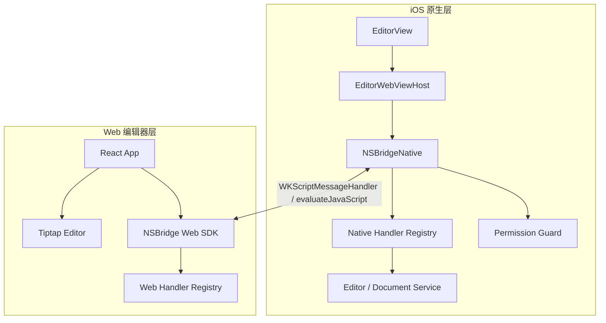
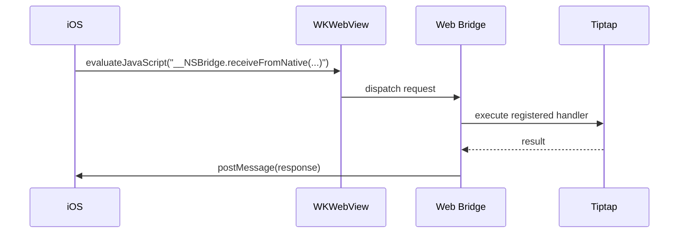
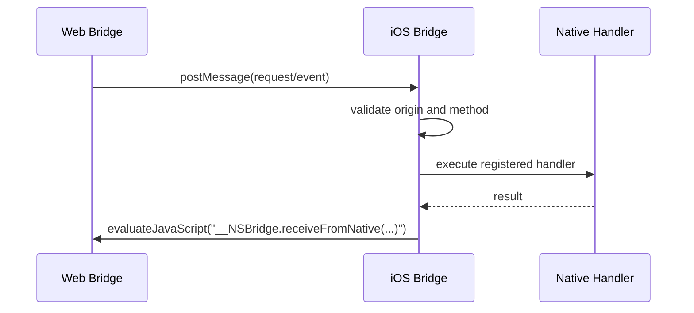
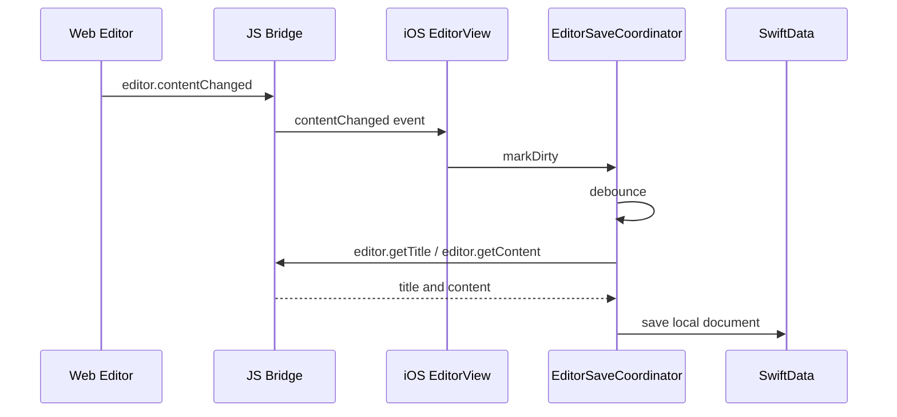

# 一页 JS Bridge 技术设计文档

## 1. 文档信息

- 产品名称：一页
- 文档版本：v0.1
- 更新时间：2026-05-19
- 关联文档：[technical-architecture.md](./technical-architecture.md)、[product-requirements.md](./product-requirements.md)
- 当前阶段：Bridge 从零设计

## 2. 设计结论

一页 JS Bridge 采用自研轻量 SDK，不直接依赖 DSBridge、WebViewJavascriptBridge 等第三方 Bridge 框架。

底层只使用 `WKWebView` 原生能力：

- Web 调 iOS：`window.webkit.messageHandlers.nsBridge.postMessage(message)`
- iOS 调 Web：`webView.evaluateJavaScript(script)`
- Web 侧提供 `Promise` API。
- iOS 侧提供方法注册、参数解析、权限校验、回调分发。

不引入开源 Bridge 框架的原因：

- Bridge 是 iOS 和 Web 的安全边界，不能把权限、协议和异常行为交给历史包袱不明的第三方库。
- 当前产品只需要稳定的双向通信，不需要复杂插件框架。
- `WKWebView` 已经提供足够可靠的通信基础，额外框架收益有限。
- 自研协议可以和笔记编辑器、自动保存、CloudKit 同步的生命周期紧密配合。

可以参考开源框架的设计思想，例如 callback id、超时、handler registry 和消息队列，但运行时代码由项目自己维护。

## 3. 目标与非目标

### 3.1 目标

- 提供 iOS 与 Web 编辑器之间稳定、类型清晰、可版本化的通信协议。
- 支持 iOS 调用 Web 编辑器命令，例如设置内容、获取内容、切换格式。
- 支持 Web 向 iOS 发送事件，例如编辑器 ready、内容变化、工具状态变化、异常。
- 支持异步返回、错误码、超时和取消。
- 支持 Bridge 未 ready 时的消息排队和安全失败。
- 限制可调用方法范围，避免 Web 任意访问原生能力。
- 为后续附件、图片、诊断、自动保存扩展预留协议空间。

### 3.2 非目标

- 不做通用 Hybrid 容器平台。
- 不做远程插件系统。
- 不允许 Web 任意执行原生命令。
- 不支持远程加载未知 Web 代码后访问高权限 Bridge。
- 不在 Bridge 中直接读写 SwiftData 或 CloudKit，Bridge 只负责跨端通信。
- MVP 不支持 Android、桌面端或独立 Web 版通信协议。

## 4. 总体架构



分层职责：

| 层级 | 职责 |
| --- | --- |
| `EditorView` | 管理编辑页 UI、工具栏、保存入口、生命周期 |
| `EditorWebViewHost` | 创建和配置 `WKWebView`，注入 Bridge 脚本，处理加载状态 |
| `NSBridgeNative` | iOS 侧 Bridge 核心，负责消息收发、方法注册、超时、回调 |
| `PermissionGuard` | 校验来源、方法白名单、参数大小和权限 |
| `NSBridge Web SDK` | Web 侧 Bridge 核心，提供 `call`、`register`、`emit` |
| `Web Handler Registry` | Web 编辑器暴露给 iOS 的命令集合 |

## 5. 通信方向

### 5.1 iOS 调 Web

适合 iOS 主动驱动编辑器：

- 初始化内容：`editor.setContent`
- 获取内容：`editor.getContent`
- 获取标题：`editor.getTitle`
- 工具栏命令：`editor.toggleBold`、`editor.toggleHeading`
- 插入内容：`editor.insertImage`、`editor.insertHorizontalRule`

流程：



### 5.2 Web 调 iOS

适合 Web 上报状态或请求原生能力：

- 编辑器初始化完成：`bridge.ready`
- 内容变化：`editor.contentChanged`
- 工具栏状态变化：`editor.selectionChanged`
- 编辑器异常：`editor.error`
- 请求选择图片：`media.pickImage`

流程：



## 6. 协议设计

### 6.1 基础消息格式

所有跨端消息都使用 JSON 对象，不传裸字符串、裸数组或多参数列表。

```json
{
  "bridgeVersion": "1.0",
  "id": "req_20260519_000001",
  "type": "request",
  "namespace": "editor",
  "method": "getContent",
  "params": {},
  "timestamp": 1779177600000
}
```

字段说明：

| 字段 | 类型 | 必填 | 说明 |
| --- | --- | --- | --- |
| `bridgeVersion` | `string` | 是 | Bridge 协议版本 |
| `id` | `string` | request/response 必填 | 请求 ID，用于匹配异步返回 |
| `type` | `string` | 是 | `request`、`response`、`event`、`ready` |
| `namespace` | `string` | 是 | 能力域，例如 `editor`、`media`、`system` |
| `method` | `string` | request/event 必填 | 方法或事件名 |
| `params` | `object` | 否 | 参数对象 |
| `timestamp` | `number` | 是 | 发送端时间戳，毫秒 |

### 6.2 返回格式

成功返回：

```json
{
  "bridgeVersion": "1.0",
  "id": "req_20260519_000001",
  "type": "response",
  "status": "success",
  "data": {
    "content": {}
  },
  "timestamp": 1779177600123
}
```

失败返回：

```json
{
  "bridgeVersion": "1.0",
  "id": "req_20260519_000001",
  "type": "response",
  "status": "error",
  "error": {
    "code": "METHOD_NOT_FOUND",
    "message": "Handler editor.getContent is not registered",
    "recoverable": true
  },
  "timestamp": 1779177600123
}
```

### 6.3 事件格式

事件不要求业务返回值，但 iOS 可以返回 ack 供 Web 调试和重试。

```json
{
  "bridgeVersion": "1.0",
  "id": "evt_20260519_000001",
  "type": "event",
  "namespace": "editor",
  "method": "contentChanged",
  "params": {
    "documentId": "local-document-id",
    "changeVersion": 12,
    "isEmpty": false
  },
  "timestamp": 1779177600456
}
```

## 7. 命名规范

Bridge 方法采用 `namespace.method` 的逻辑命名，对外文档分成命名空间和方法两列。

代码内部可以拆成：

- `namespace`: `editor`
- `method`: `getContent`
- 完整名：`editor.getContent`

命名原则：

- 使用动词开头：`getContent`、`setContent`、`toggleBold`。
- 事件使用过去式或状态变化语义：`ready`、`contentChanged`、`selectionChanged`。
- 不暴露技术实现名，例如 `tiptap.toggleNode`。
- 不使用拼写错误作为协议名，例如旧实现中的 `toggleCodeBlcok` 不进入新协议。
- 废弃接口只能标记 deprecated，不复用旧名字表达新语义。

## 8. 生命周期

### 8.1 初始化阶段

1. iOS 创建 `WKWebViewConfiguration`。
2. iOS 注册 `WKScriptMessageHandler`，名称固定为 `nsBridge`。
3. iOS 注入最小启动脚本，创建 `window.NSBridgeNativeChannel`。
4. Web 应用启动，初始化 `NSBridge Web SDK`。
5. Web 编辑器初始化完成后发送 `editor.ready`。
6. iOS 收到 ready 后标记 Bridge 可用，开始发送 `editor.setContent`。

### 8.2 Ready 事件

```json
{
  "bridgeVersion": "1.0",
  "id": "evt_ready_000001",
  "type": "ready",
  "namespace": "editor",
  "method": "ready",
  "params": {
    "editorVersion": "1.0.0",
    "supportedBridgeVersion": "1.0",
    "capabilities": [
      "editor.setContent",
      "editor.getContent",
      "editor.getTitle",
      "editor.toggleBold"
    ]
  },
  "timestamp": 1779177600000
}
```

### 8.3 消息排队

iOS 侧规则：

- Bridge 未 ready 时，只允许排队 `editor.setContent` 等初始化必要命令。
- 工具栏点击类命令在未 ready 时直接失败，不排队。
- 队列有最大长度，建议 20 条。
- WebView 重新加载时清空所有 pending 请求。

Web 侧规则：

- Native channel 不存在时，`callNative` 返回 `NATIVE_UNAVAILABLE`。
- `editor.ready` 发送失败时，Web 继续编辑器初始化，但显示本地可编辑状态。

## 9. 第一阶段接口

### 9.1 iOS 调 Web：编辑器命令

| 完整方法 | 参数 | 返回 | 说明 |
| --- | --- | --- | --- |
| `editor.setContent` | `{ content: object, focus?: boolean }` | `{ applied: boolean }` | 设置 Tiptap JSON 内容 |
| `editor.getContent` | `{}` | `{ content: object, plainText: string, isEmpty: boolean }` | 获取完整编辑内容 |
| `editor.getTitle` | `{}` | `{ title: string }` | 获取文档标题 |
| `editor.focus` | `{}` | `{ focused: boolean }` | 聚焦编辑器 |
| `editor.blur` | `{}` | `{ blurred: boolean }` | 取消聚焦 |
| `editor.toggleBold` | `{}` | `{ active: boolean }` | 切换加粗 |
| `editor.toggleItalic` | `{}` | `{ active: boolean }` | 切换斜体 |
| `editor.toggleUnderline` | `{}` | `{ active: boolean }` | 切换下划线 |
| `editor.toggleStrike` | `{}` | `{ active: boolean }` | 切换删除线 |
| `editor.toggleCode` | `{}` | `{ active: boolean }` | 切换行内代码 |
| `editor.setParagraph` | `{}` | `{ applied: boolean }` | 切换为正文段落 |
| `editor.toggleHeading` | `{ level: 1 | 2 | 3 | 4 | 5 }` | `{ active: boolean, level: number }` | 切换标题 |
| `editor.toggleBulletList` | `{}` | `{ active: boolean }` | 切换无序列表 |
| `editor.toggleOrderedList` | `{}` | `{ active: boolean }` | 切换有序列表 |
| `editor.toggleTaskList` | `{}` | `{ active: boolean }` | 切换任务列表 |
| `editor.toggleBlockquote` | `{}` | `{ active: boolean }` | 切换引用 |
| `editor.toggleCodeBlock` | `{}` | `{ active: boolean }` | 切换代码块 |
| `editor.setTextAlign` | `{ align: "left" | "center" | "right" | "justify" }` | `{ align: string }` | 设置对齐 |
| `editor.setHorizontalRule` | `{}` | `{ inserted: boolean }` | 插入分割线 |
| `editor.insertTable` | `{ rows?: number, cols?: number, withHeaderRow?: boolean }` | `{ inserted: boolean }` | 插入表格 |

### 9.2 Web 调 iOS：编辑器事件

| 完整方法 | 参数 | 说明 |
| --- | --- | --- |
| `editor.ready` | `{ editorVersion, supportedBridgeVersion, capabilities }` | 编辑器和 Bridge 已可用 |
| `editor.contentChanged` | `{ changeVersion, isEmpty }` | 内容发生变化，用于触发自动保存防抖 |
| `editor.selectionChanged` | `{ activeTools }` | 选区和工具激活状态变化 |
| `editor.focusChanged` | `{ focused }` | 编辑器聚焦状态变化 |
| `editor.error` | `{ code, message, detail? }` | 编辑器异常 |

`activeTools` 结构：

```json
{
  "bold": true,
  "italic": false,
  "underline": false,
  "strike": false,
  "code": false,
  "heading": {
    "active": true,
    "level": 2
  },
  "bulletList": false,
  "orderedList": false,
  "taskList": false,
  "blockquote": false,
  "codeBlock": false,
  "textAlign": "left"
}
```

## 10. Web SDK 设计

Web 侧对业务暴露一个小 API：

```ts
type BridgeCallOptions = {
  timeoutMs?: number
}

window.NSBridge.call<TParams, TResult>(
  namespace: string,
  method: string,
  params?: TParams,
  options?: BridgeCallOptions
): Promise<TResult>

window.NSBridge.emit<TParams>(
  namespace: string,
  method: string,
  params?: TParams
): void

window.NSBridge.register<TParams, TResult>(
  namespace: string,
  method: string,
  handler: (params: TParams) => TResult | Promise<TResult>
): void
```

编辑器模块不直接访问 `window.webkit.messageHandlers`，只能通过 `NSBridge` SDK 通信。

建议目录：

```text
web/src/bridge/
  index.ts
  types.ts
  errors.ts
  web-bridge.ts
  editor-handlers.ts
  native-events.ts
```

## 11. iOS SDK 设计

iOS 侧建议拆成以下文件：

```text
iOS/note/bridge/
  NSBridgeMessage.swift
  NSBridgeError.swift
  NSBridgeNative.swift
  NSBridgeHandlerRegistry.swift
  NSBridgePermissionGuard.swift
  NSBridgeWebViewInstaller.swift
  EditorBridgeHandlers.swift
```

核心职责：

| 模块 | 职责 |
| --- | --- |
| `NSBridgeMessage` | 定义 request、response、event 的 Codable 结构 |
| `NSBridgeNative` | 维护 pending 请求、发送 JS、接收 postMessage |
| `NSBridgeHandlerRegistry` | 注册 Web 调 iOS 的 handler |
| `NSBridgePermissionGuard` | 校验来源、方法白名单、参数大小 |
| `NSBridgeWebViewInstaller` | 统一配置 `WKWebViewConfiguration` |
| `EditorBridgeHandlers` | 处理 editor 相关事件，转发给 `EditorViewModel` 和保存协调器 |

iOS 侧调用示例：

```swift
let result: EditorContentResult = try await bridge.callWeb(
    namespace: "editor",
    method: "getContent",
    params: EmptyParams(),
    timeout: .seconds(3)
)
```

Web 调 iOS 注册示例：

```swift
bridge.register(namespace: "editor", method: "contentChanged") { message in
    saveCoordinator.markDirty(changeVersion: message.params.changeVersion)
    return EmptyResult()
}
```

## 12. 错误码

| 错误码 | 说明 | 是否可重试 |
| --- | --- | --- |
| `BRIDGE_NOT_READY` | Bridge 尚未 ready | 是 |
| `NATIVE_UNAVAILABLE` | Web 侧找不到原生通道 | 是 |
| `WEB_UNAVAILABLE` | iOS 侧 WebView 不可用或已释放 | 是 |
| `TIMEOUT` | 调用超时 | 是 |
| `METHOD_NOT_FOUND` | 方法未注册 | 否 |
| `INVALID_MESSAGE` | 消息结构不合法 | 否 |
| `INVALID_PARAMS` | 参数不合法 | 否 |
| `UNAUTHORIZED` | 无权限调用该方法 | 否 |
| `PAYLOAD_TOO_LARGE` | 参数或返回数据过大 | 否 |
| `HANDLER_ERROR` | handler 执行异常 | 视情况 |
| `VERSION_UNSUPPORTED` | Bridge 协议版本不兼容 | 否 |

默认超时：

- 普通编辑命令：2 秒。
- 获取内容：3 秒。
- 图片选择、文件选择：30 秒。
- ready 等生命周期事件：不使用普通请求超时，由 WebView 加载超时控制。

## 13. 安全设计

### 13.1 来源控制

- 生产环境只加载 App 内置编辑器资源。
- 不允许远程页面访问高权限 Bridge。
- `WKNavigationDelegate` 需要限制导航，只允许本地服务地址或 bundle 资源地址。
- 外链点击不在当前 WebView 中直接跳转，后续由原生决定是否打开系统浏览器。

### 13.2 方法白名单

- iOS 侧维护可被 Web 调用的方法白名单。
- Web 侧维护可被 iOS 调用的方法注册表。
- 未注册方法一律返回 `METHOD_NOT_FOUND`。
- 空方法名、跨 namespace 调用、私有方法名前缀一律拒绝。

### 13.3 参数限制

- 单次消息大小需要限制，MVP 建议 2 MB。
- 图片和附件不通过 Bridge 传 base64 大对象，只传文件引用或临时 ID。
- 所有参数必须是 JSON 可序列化对象。
- iOS 侧解析失败时返回 `INVALID_PARAMS`，不能崩溃。

### 13.4 日志脱敏

Bridge 日志只能记录：

- namespace
- method
- status
- error code
- duration
- payload size

禁止记录：

- 笔记正文
- 笔记标题
- 图片内容
- 用户输入原文
- 可还原正文的 Tiptap JSON

## 14. 自动保存协作

Bridge 不直接保存数据，但它提供自动保存所需的状态事件。

推荐流程：



约束：

- 内容变化事件不携带完整正文，只携带版本号和空状态。
- 保存时由 iOS 主动拉取完整内容。
- 同一篇文档同一时间只允许一个保存任务执行。
- Bridge 超时时不能关闭编辑页，也不能丢弃 Web 当前内容。

## 15. 版本兼容

协议版本采用主版本兼容策略：

- `1.x` 内新增可选字段和新增方法，不破坏旧方法。
- 修改字段含义、删除字段、修改返回结构必须升级到 `2.0`。
- Web ready 时上报 `supportedBridgeVersion` 和 `capabilities`。
- iOS 根据 capabilities 决定是否启用某个工具栏能力。

废弃策略：

- 标记 deprecated 后至少保留一个 App 大版本。
- 新旧方法并存期间，iOS 优先调用新方法。
- 不复用废弃方法名承载新语义。

## 16. 测试策略

### 16.1 Web 单元测试

- message id 生成唯一。
- `call` 能正确 resolve / reject。
- 超时后清理 pending 请求。
- 未注册 handler 返回 `METHOD_NOT_FOUND`。
- handler throw 时返回 `HANDLER_ERROR`。
- `editor.setContent` / `editor.getContent` 往返一致。

### 16.2 iOS 单元测试

- `NSBridgeMessage` Codable 解析。
- 参数非法时返回 `INVALID_PARAMS`。
- 方法白名单拦截。
- pending 请求超时清理。
- WebView reload 后取消未完成请求。

### 16.3 集成测试

- 新建笔记进入编辑器后收到 `editor.ready`。
- iOS 调 `editor.setContent` 后 Web 正确渲染。
- 用户输入后 Web 发送 `editor.contentChanged`。
- iOS 调 `editor.getContent` 能保存并重新打开。
- 工具栏点击 bold / heading 后 Web 状态变化并回传 `selectionChanged`。
- WebView 重新加载后 Bridge 能重新握手。

## 17. 第一阶段实施计划

### 17.1 第一批交付

1. Web 新建 `web/src/bridge`，实现 `NSBridge` 基础 SDK。
2. iOS 新建 `iOS/note/bridge`，实现 `NSBridgeNative` 和 message model。
3. `SLWebView` 或新的 `EditorWebViewHost` 接入 `WKScriptMessageHandler`。
4. Web 注册第一批 `editor.*` handler。
5. iOS 接收 `editor.ready`、`editor.contentChanged`、`editor.selectionChanged`。
6. 编辑页保存流程改成 async Bridge 调用。

### 17.2 第二批交付

1. 自动保存协调器。
2. Bridge 日志和耗时统计。
3. 图片选择和附件引用协议。
4. Bridge 集成测试。
5. Web 构建产物同步到 `iOS/note/doc.bundle` 的稳定脚本。

## 18. 待确认问题

- 编辑器资源生产环境使用 `doc.bundle` 直读，不再通过本地 HTTP 服务访问。
- Bridge 消息大小限制是否需要小于 2 MB。
- 图片插入第一期是只插入本地临时引用，还是同时进入附件服务。
- 自动保存触发间隔，建议初始值为内容变化后 800 ms 到 1500 ms。
- 生产环境是否完全关闭 `webView.isInspectable`。
