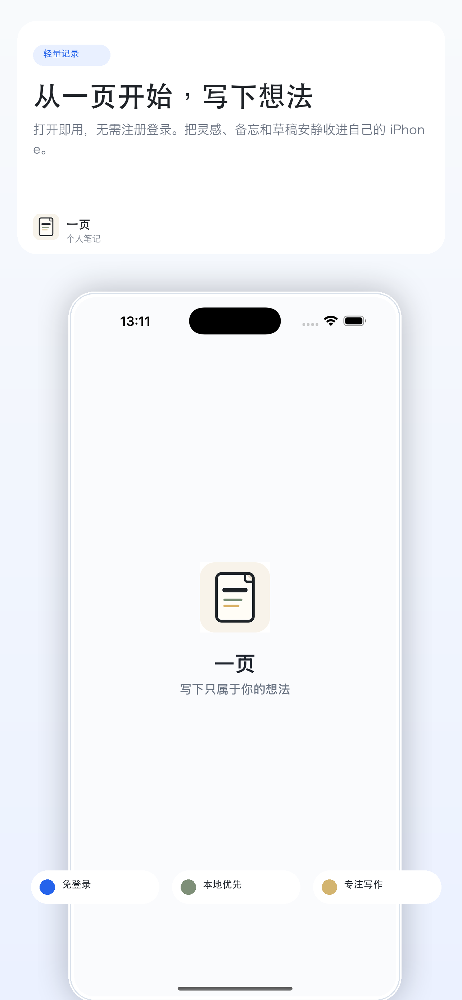
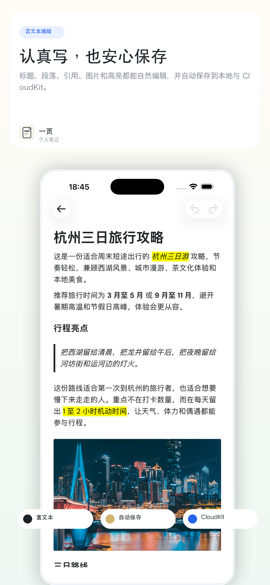
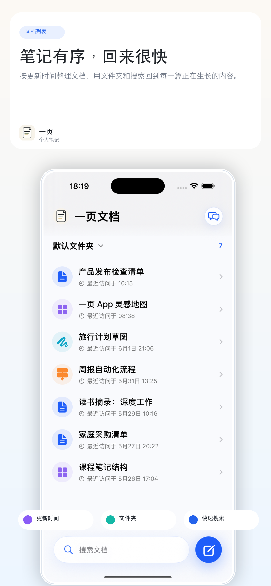
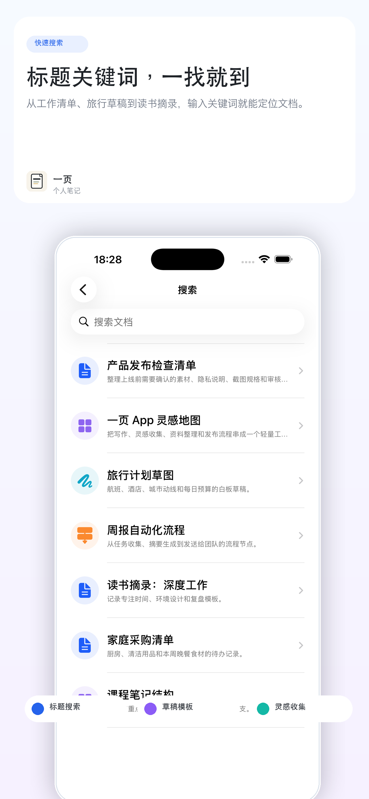

# 我做了一个不用登录的 iPhone 笔记 App

.png>)

我一直想要一个很简单、很安静的笔记 App。

不是那种一打开就让我注册、选模板、研究功能入口的工具。  
而是打开就能写，没网也能写，写完之后会好好保存在自己的设备和 Apple 生态里。

于是我开始做「一页」。

它不是一个复杂的知识库，也不是团队协作文档。  
我更想把它做成一个安静的个人文档 App：灵感、草稿、旅行计划、读书摘录、工作清单，都可以先从一页开始。

## 免登录，打开就能写

第一次打开「一页」，不需要注册，不需要填手机号，也不用再多记一个密码。  
进入 App，就可以直接写。

我觉得私人笔记工具不应该在记录之前先打断你。  
很多想法本来就很轻，犹豫几秒，可能就散了。

## 本地优先，没网也能继续

「一页」会先把内容保存到本机。  
网络不好、在高铁上、咖啡馆 Wi-Fi 不稳定的时候，也可以继续写。

我希望同步是在后台慢慢完成的事，而不是挡在写作前面的事。  
写下来的那一刻，先让它稳稳落地。

## CloudKit 同步，资料留在自己的 Apple 生态里

如果你已经在系统里登录了 Apple ID，笔记可以通过 CloudKit 在同一 Apple ID 的设备之间同步。  
「一页」不自建笔记内容服务器，也不要求你注册一个新的 App 账号。

这点对我很重要。  
私人笔记，首先应该是私人的。

## 认真写，也安心保存

「一页」支持标题、段落、引用、图片、高亮这些常用富文本编辑能力。  
可以写草稿，可以整理资料，也可以把一个很小的念头慢慢养成一篇完整文档。

我不想把它做成一个堆满按钮的工具。  
它应该更像一个安静的地方：你打开它，写一点，保存好，之后还能找回来。

## 笔记有序，回来很快

写得多了，最怕的不是没有记录，而是再也找不到。

所以「一页」会按更新时间整理文档，也支持文件夹和搜索。  
工作清单、旅行草稿、读书摘录、临时灵感，都能有地方放，也能被找回来。

我知道现在笔记 App 已经很多了。

Apple Notes 很方便，但整理复杂资料时有点不够。  
Notion 很强，但有时候我只是想安静写点自己的东西。  
Obsidian 很自由，但对很多人来说，上手成本又偏高。

「一页」想做的是中间那个位置。

比系统备忘录更适合长期整理，  
比大型知识库更轻，  
更偏向 Apple 用户自己的私人文档空间。

现在它还在早期阶段，我会先把最基础的记录、编辑、整理、搜索和同步体验打磨好。  
后面也想继续支持更丰富的文档形态，比如灵感地图、白板、流程图。

如果你也喜欢这种“打开就写、资料归自己、工具别打扰我”的感觉，可以关注一下。  
我会在这里继续记录「一页」的开发过程、设计取舍和上线进度。

## 互动

你现在最常用的笔记 App 是哪个？  
如果让你选一个最重要的点，你会更在意：离线可用、隐私、同步稳定，还是编辑体验？

## 话题

#笔记App #效率工具 #iPhone软件 #Apple生态 #独立开发 #个人知识管理 #写作工具 #iOSApp #Notion替代 #备忘录

## 置顶评论

这是我正在做的个人文档 App「一页」。目前主打免登录、本地优先、CloudKit 同步和富文本编辑。后续会继续分享开发进度，也欢迎留言说说你理想中的笔记 App 应该是什么样。
