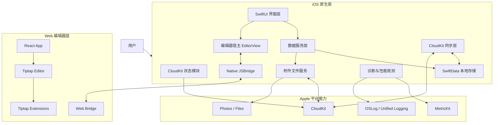
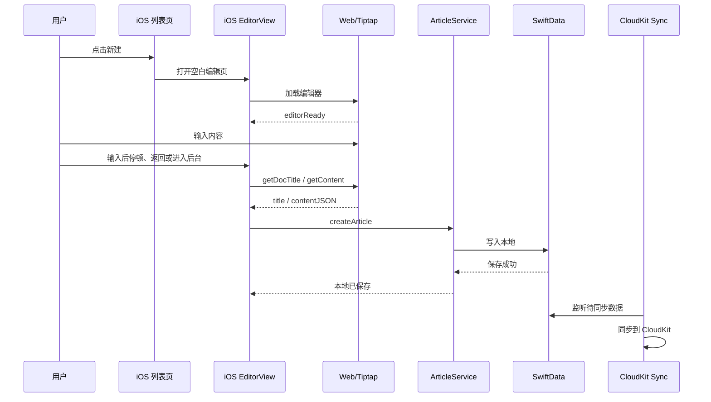
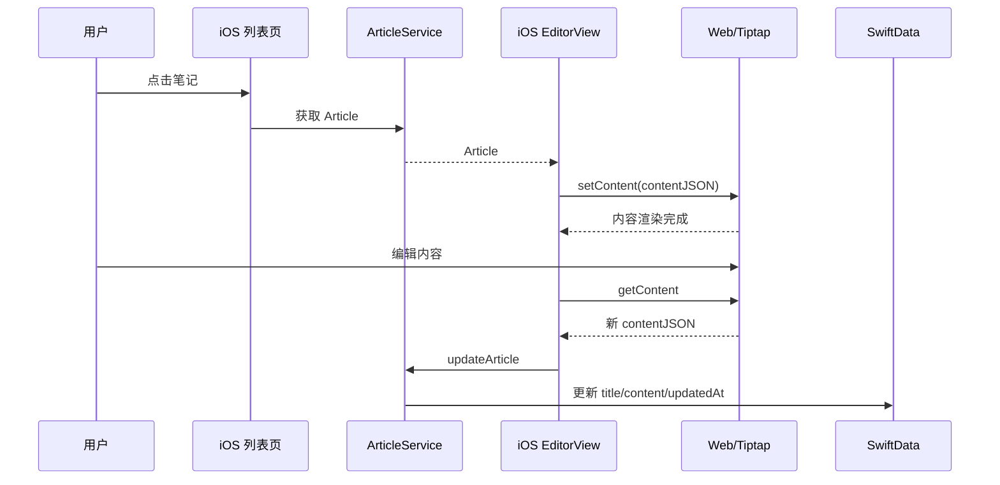

# 个人笔记 iOS 整体技术架构

## 1. 文档信息

- 产品名称：一页
- 文档版本：v0.1
- 更新时间：2026-05-17
- 关联文档：[product-requirements.md](./product-requirements.md)

## 2. 架构目标

本产品采用 iOS 原生应用承载核心体验，React + Tiptap 提供富文本编辑能力，用户数据存储在本地与 CloudKit 中。

架构目标：

- 原生优先：导航、列表、文件夹、搜索、存储、同步等能力由 iOS 原生层负责。
- 编辑器专业化：复杂富文本编辑能力由 Web 编辑器负责，避免在 SwiftUI 中重复实现编辑内核。
- 本地优先：所有笔记读写先落本地，网络和 CloudKit 同步不阻塞用户编辑。
- 隐私优先：不建设产品方笔记内容服务器，用户笔记内容只进入设备本地容器和 CloudKit。
- 边界清晰：iOS 与 Web 通过明确的 JSBridge 协议通信，避免两端互相感知过多内部实现。
- 可演进：MVP 可以先基于 SwiftData 本地存储，后续平滑扩展到 CloudKit 同步、附件管理和冲突处理。

## 3. 当前实现概览

当前仓库已经具备以下基础：

- iOS 应用：SwiftUI。
- 本地数据：SwiftData，当前模型为 `Article`。
- 主界面：`NavigationStack` 承载单一笔记首页。
- 笔记首页：SwiftUI 自定义首页 + SwiftData `@Query`。
- 编辑页面：SwiftUI `EditorView` 承载 WebView。
- WebView：自定义 `DWKWebView`/`WKWebView`，通过 DSBridge 与 Web 编辑器通信。
- Web 编辑器：React + Tiptap + Vite。
- Web 资源承载：iOS 内置 `doc.bundle`，运行时通过 Swifter 本地 HTTP 服务访问 `http://localhost:8080/index.html`。
- 编辑器内容：当前以 Tiptap JSON 序列化结果字符串保存到 `Article.markdownText`。

当前关键路径：

- iOS 启动时创建 SwiftData `ModelContainer`。
- 应用进入 active 状态时启动本地 SwifterServer。
- 编辑页加载 `http://localhost:8080/index.html`。
- iOS 调用 Web 方法获取标题和内容。
- iOS 将内容保存到 SwiftData。

## 4. 总体架构

## 5. 分层设计

### 5.1 iOS 表现层

职责：

- 管理应用导航、列表、文件夹、搜索、设置、编辑页入口。
- 展示 CloudKit 状态、同步状态和错误提示。
- 响应用户操作，例如新建、编辑、删除、搜索。
- 在编辑页中承载 WebView 和原生工具栏。

建议模块：

| 模块 | 职责 |
| --- | --- |
| `MainContentView` | 应用主框架，承载笔记首页 |
| `ListView` | 笔记首页、文件夹入口、搜索入口、新建入口、删除入口 |
| `EditorView` | 编辑页面宿主，管理保存、返回、键盘和工具栏 |
| `Tools` / `EditorViewModel` | 原生编辑工具栏状态 |
| `SettingsView` | CloudKit、隐私与同步状态 |

### 5.2 iOS 业务层

业务层应从 SwiftUI View 中逐步抽出，避免保存、同步、冲突处理都堆在页面里。

建议服务：

| 服务 | 职责 |
| --- | --- |
| `CloudKitAccountService` | 系统 Apple ID 与 CloudKit 可用性、系统设置入口 |
| `ArticleService` | 笔记查询、创建、更新、删除 |
| `EditorContentService` | Tiptap JSON 正文、标题、摘要、纯文本索引派生 |
| `SyncService` | CloudKit 同步状态、冲突检测、重试 |
| `AttachmentService` | 图片和附件的保存、引用、清理 |
| `SearchService` | 标题搜索、全文搜索索引 |
| `DiagnosticsService` | MetricKit 诊断 payload、OSLog 分类日志、性能 signpost |

MVP 可以先保留轻量服务层，但新增能力应尽量进入服务，而不是继续写入 View。

### 5.3 数据层

当前使用 SwiftData，建议继续作为本地数据访问入口。

目标数据层包含：

- SwiftData 本地数据库。
- CloudKit 同步配置。
- CloudKit Record 和 CKAsset，用于笔记、图片和附件。
- 数据迁移与版本管理。

### 5.3.1 本地数据模型

当前模型：

| 字段 | 类型 | 说明 |
| --- | --- | --- |
| `title` | `String` | 笔记标题 |
| `markdownText` | `String` | 当前字段名，实际保存 Tiptap JSON 字符串；后续建议迁移为 `contentJSON` |
| `createDate` | `Date` | 创建时间 |
| `updateDate` | `Date` | 更新时间 |

目标模型建议：

| 字段 | 类型 | 说明 |
| --- | --- | --- |
| `id` | `UUID` | 笔记唯一 ID |
| `title` | `String` | 笔记标题 |
| `contentJSON` | `String` | Tiptap JSON 主内容 |
| `plainText` | `String` | 搜索和摘要用纯文本 |
| `excerpt` | `String` | 列表摘要 |
| `attachmentRefs` | `[String]` | 正文引用到的附件 ID 列表，可由 `contentJSON` 派生 |
| `createdAt` | `Date` | 创建时间 |
| `updatedAt` | `Date` | 更新时间 |
| `contentVersion` | `Int` | 内容结构版本 |
| `syncStatus` | `String` | 本地同步状态 |

命名建议：

- 后续将 `markdownText` 迁移为 `contentJSON`。
- 不保存 Markdown 副本，不做双格式存储；如需导出 Markdown，只在导出动作中从 `contentJSON` 临时转换。

### 5.4 Web 编辑器层

Web 编辑器由 React + Tiptap 构成，只负责编辑器内部体验。

职责：

- 初始化 Tiptap Editor。
- 注册扩展，例如标题、列表、任务列表、引用、代码块、表格、图片、颜色、对齐。
- 渲染编辑区域。
- 向 iOS 暴露编辑命令。
- 将选区状态、激活工具状态、内容变化事件回传给 iOS。

不建议 Web 层负责：

- CloudKit 同步。
- 笔记列表。
- 本地数据库读写。
- 业务级权限或隐私逻辑。

### 5.5 Bridge 层

iOS 与 Web 通过 DSBridge 通信。

Bridge 层原则：

- 方法名稳定，参数结构版本化。
- iOS 只调用编辑器公开命令，不直接操作 Tiptap 内部对象。
- Web 只发送编辑器事件，不直接写 iOS 数据库。
- 所有 Bridge 调用都需要考虑超时、失败和编辑器未就绪状态。

建议把 Bridge 协议独立成文档：

- `docs/editor-bridge-protocol.md`

## 6. 关键数据流

### 6.1 新建笔记

### 6.2 编辑已有笔记

### 6.3 工具栏状态同步

### 6.4 CloudKit 同步

MVP 推荐采用 SwiftData + CloudKit 同步能力作为优先方案，前提是数据模型满足 CloudKit 约束。

同步策略：

- 本地写入优先。
- CloudKit 后台同步。
- UI 展示本地保存状态和 CloudKit 同步状态。
- 冲突以 `updatedAt` 和内容版本为基础进行处理。
- MVP 暂不提供最近删除和恢复能力；删除前必须强确认，确认后执行删除并同步到 CloudKit。

附件策略：

- 图片和附件不直接内嵌到 `contentJSON`。
- `contentJSON` 中只保存附件引用 ID、相对路径或必要展示元数据。
- 附件文件保存为 CKAsset，并通过 CloudKit Record 管理。
- 附件需要稳定 ID，保证多设备同步后正文引用仍能解析到同一文件。
- 删除笔记时，清理或标记该笔记独占的附件，避免 CloudKit 中长期残留无主文件。
- `AttachmentService` 负责附件生命周期。

## 7. 免登录与 CloudKit 账号架构

MVP 已确认采用完全免登录模式。App 不建设自有账号系统，也不接入 Sign in with Apple 作为 App 内登录流程。笔记数据由系统层 Apple ID 下的 CloudKit 容器承载。

职责：

- `CloudKitAccountService` 检查系统 Apple ID 与 CloudKit 状态。
- 检查 CloudKit 容器可用性。
- CloudKit 不可用时提示用户同步受限，但不阻止本地使用。
- 提供跳转系统设置的入口，帮助用户检查 Apple ID 状态。

注意：

- 免登录不等于无需 Apple ID；跨设备同步仍依赖用户在系统设置中登录 Apple ID，并允许 App 使用 CloudKit。
- CloudKit 不可用时，本地优先能力仍应可用。
- 同步状态与本地保存状态需要分开展示。
- 后续如增加会员、分享或跨平台能力，再单独评估是否需要账号体系。

## 8. Web 资源交付架构

当前方案：

- Web 端通过 Vite 构建。
- 构建产物复制到 iOS 的 `doc.bundle`。
- iOS 启动本地 Swifter HTTP 服务。
- WebView 加载 `http://localhost:8080/index.html`。

优点：

- 与普通 Web 开发体验接近。
- 静态资源路径和浏览器环境更稳定。
- 便于调试 React/Tiptap。

风险：

- 固定端口可能被占用。
- 本地 HTTP 服务生命周期需要管理。
- App Store 审核时需要确保该服务只绑定本机访问。
- 编辑器资源版本需要和 iOS 包版本绑定。

建议改进：

- SwifterServer 启动前检查是否已启动，避免重复注册和重复启动。
- 仅监听 localhost。
- 将端口配置集中管理，必要时支持动态端口。
- 生产包关闭 WebView inspectable。
- 建立 Web 构建脚本，将 `web/dist` 稳定复制到 `iOS/note/doc.bundle`。

## 9. 自动保存架构

当前代码中保存由编辑页点击保存按钮触发。目标架构中，自动保存是 MVP 必选能力，手动保存只作为辅助操作。

目标保存策略：

- 防抖自动保存：内容变化后延迟保存。
- 返回保存：用户返回列表前尝试保存。
- 后台保存：App 进入 inactive/background 前保存当前编辑内容。
- 手动保存：用户点击保存按钮时立即保存一次，作为辅助兜底。

建议流程：

1. Web 编辑器发送 `contentChanged` 事件。
2. iOS 标记当前文档为 dirty。
3. `EditorSaveCoordinator` 做防抖。
4. 到达保存时机后调用 `getDocTitle` 和 `getContent`。
5. `ArticleService` 更新本地数据。
6. `SyncService` 处理 CloudKit 同步状态。

需要避免：

- 每次输入都全量序列化并写库。
- 保存逻辑阻塞主线程。
- Bridge 未返回时重复并发保存同一篇笔记。
- 只依赖用户点击保存按钮。

## 10. 崩溃与性能诊断架构

MVP 需要采集匿名崩溃和性能数据，优先使用 iOS 系统框架，不引入会采集用户内容的埋点体系。

推荐组件：

| 组件 | 职责 |
| --- | --- |
| `MetricKit` | 接收系统采集的 app diagnostics、crash diagnostics、power 和 performance metrics |
| `OSLog` | 输出结构化本地日志，按 editor、storage、icloud、bridge 等 category 分类 |
| `OSLog Signpost` | 标记编辑器加载、自动保存、CloudKit 同步、Bridge 调用等关键链路耗时 |
| `DiagnosticsService` | 统一处理诊断 payload、脱敏、采样、上报或导出策略 |

采集范围：

- App 版本、构建号、iOS 版本、设备型号。
- 崩溃类型、异常类型、调用栈摘要。
- 启动耗时、内存、CPU、磁盘写入、耗电、卡顿等系统指标。
- 编辑器加载耗时、自动保存耗时、CloudKit 同步耗时、Bridge 调用耗时。

禁止采集：

- 笔记正文。
- 笔记标题。
- 图片和附件内容。
- 用户输入原文。
- 剪贴板内容。
- 可直接还原用户笔记内容的日志字段。

隐私要求：

- OSLog 中涉及变量时默认使用隐私保护或脱敏字段。
- 诊断事件只记录模块名、状态码、耗时和错误类型。
- 设置页需要说明匿名崩溃和性能数据用途。
- 后续如接入第三方诊断平台，需要重新评估隐私、合规和用户开关。

参考：

- [MetricKit | Apple Developer Documentation](https://developer.apple.com/documentation/metrickit)
- [OSLog | Apple Developer Documentation](https://developer.apple.com/documentation/os/OSLog)

## 11. 错误处理架构

错误分层：

| 层级 | 典型错误 | 处理方式 |
| --- | --- | --- |
| CloudKit Account | 系统 Apple ID 未登录、CloudKit 不可用 | 提示同步受限并提供系统设置入口 |
| CloudKit | 空间不足、同步失败 | 展示同步状态和系统设置入口 |
| Data | 保存失败、迁移失败 | 保留编辑内容，提示重试 |
| WebView | 资源加载失败、Bridge 超时 | 重新加载编辑器或提示恢复 |
| Editor | JSON 解析失败、扩展异常 | 降级展示纯文本或错误页 |
| Attachment | 图片读取失败、上传失败 | 提示重新选择或稍后同步 |

原则：

- 不能让用户无感丢内容。
- 保存失败时不要关闭编辑页。
- Bridge 失败时保留 Web 端当前内容。
- 同步失败不等于本地保存失败，两者提示需要分开。

## 12. 构建与发布架构

建议建立统一构建流程：

1. 安装 Web 依赖：`pnpm install`
2. 构建 Web 编辑器：`pnpm build`
3. 清理旧 `doc.bundle` 静态资源。
4. 将 `web/dist` 复制到 `iOS/note/doc.bundle`。
5. Xcode 构建 iOS App。
6. 运行基础冒烟测试。

建议脚本：

- `script/build-web.sh`
- `script/sync-doc-bundle.sh`
- `script/build-ios.sh`

版本策略：

- iOS App 版本记录当前内置编辑器版本。
- Web 编辑器构建产物随 App 发版，不从远端动态下载。
- Bridge 协议版本写入 iOS 和 Web 双端。

## 13. 测试策略

### 13.1 iOS 测试

- `ArticleService` 单元测试。
- 数据模型迁移测试。
- CloudKit 账号状态处理测试。
- CloudKit 不可用状态测试。
- 编辑页保存流程 UI 测试。
- MetricKit payload 处理测试。
- OSLog 分类和隐私字段检查。

### 13.2 Web 测试

- Tiptap 扩展初始化测试。
- Bridge 方法注册测试。
- `setContent` / `getContent` 往返测试。
- 内容 JSON 兼容测试。

### 13.3 集成测试

- 新建笔记后列表出现。
- 编辑旧笔记后内容保持。
- 杀进程后重新打开内容不丢失。
- 离线编辑后网络恢复同步。
- 多设备编辑冲突处理。

## 14. 安全与隐私

- 笔记正文不上传产品方服务器。
- 不采集正文、标题、图片内容。
- 采集匿名崩溃和性能数据，优先使用 MetricKit、OSLog 和 OSLog Signpost。
- 崩溃和性能诊断必须过滤用户内容。
- 附件存入 CloudKit，正文只保存引用；本地只保留系统同步缓存。
- WebView 加载本地可信资源，不加载远程编辑器代码。
- Bridge 只暴露必要方法。
- 生产环境关闭 WebView 调试能力。

## 15. 架构演进路线

### 15.1 阶段一：MVP 稳定化

- 明确 `Article` 数据模型。
- 完成免登录启动流程。
- 完成基础 CloudKit 配置。
- 梳理 JSBridge 方法命名和参数。
- 完成自动保存、手动保存兜底和列表刷新。
- 接入 MetricKit、OSLog 和关键链路 signpost。
- Web 构建产物自动同步到 `doc.bundle`。

### 15.2 阶段二：本地优先体验

- 保存状态展示。
- 标题、摘要、纯文本派生。
- 搜索。
- 删除强确认。
- 编辑器加载失败恢复。

### 15.3 阶段三：CloudKit 同步增强

- 多设备同步验证。
- 同步状态管理。
- 冲突处理。
- 附件 CloudKit 存储。
- 最近删除和删除后恢复。

### 15.4 阶段四：编辑器能力增强

- 图片管理。
- 导入导出。
- 更完整的表格工具。
- Markdown 导出，不改变 Tiptap JSON 唯一存储格式。
- iPad 适配与多窗口能力。

## 16. 当前代码改造建议

优先级从高到低：

1. 将 `Article.markdownText` 迁移为 `contentJSON`，明确正文唯一持久化格式是 Tiptap JSON。
2. 新增 `Article.id`、`plainText`、`excerpt`、`updatedAt` 更新逻辑。
3. 将 `EditorView.saveInfo()` 中的保存流程抽到 `ArticleService` 或新的 `EditorSaveCoordinator`。
4. 修正保存时未更新 `updateDate` 的问题。
5. 为 SwifterServer 增加启动状态保护，避免重复启动。
6. 统一 Bridge 方法命名，例如 `toggleCodeBlcok` 后续应迁移为 `toggleCodeBlock`。
7. 为 `setContent` 增加 JSON 解析失败保护。
8. 生产环境关闭 `wkWebView.isInspectable`。
9. 增加 Web 构建到 `doc.bundle` 的自动脚本。
10. 新增 `DiagnosticsService`，接入 MetricKit、OSLog 和 OSLog Signpost。

## 17. 已确认技术决策

- CloudKit 同步采用 SwiftData + CloudKit 作为 MVP 数据同步底座。
- 是否要求端到端加密，或完全依赖 Apple CloudKit 安全能力？
- Web 编辑器是否继续通过本地 HTTP 服务加载，还是改为直接加载本地 HTML 文件？
